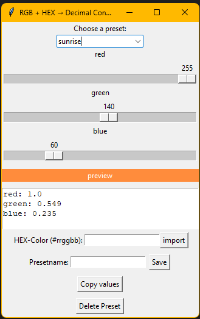

# HEX + RGB to Decimal Converter (GUI Tool)

A lightweight Python GUI to convert RGB or HEX color values into decimal values for use with LED lights (e.g. WS2812/Neopixel).

## Features

- RGB sliders with live color preview  
- HEX input field (e.g. `#ff9900`)  
- Converts values into Decimal `red:`, `green:`, `blue:` format (range: 0.0–1.0)  
- Save, load and delete custom color presets  
- Copy formatted for YAML blocks to clipboard

## Screenshot



## Presets

Presets are stored in presets.json and can be edited directly in the GUI or manually in the file.

## Installation

**Requirements:**

- Python 3.7 or newer  
- No external libraries required (only Python standard library)

**Run:**

```bash
python esphome_color_gui.py

## Presets

Presets are stored in presets.json and can be edited directly in the GUI or manually in the file.